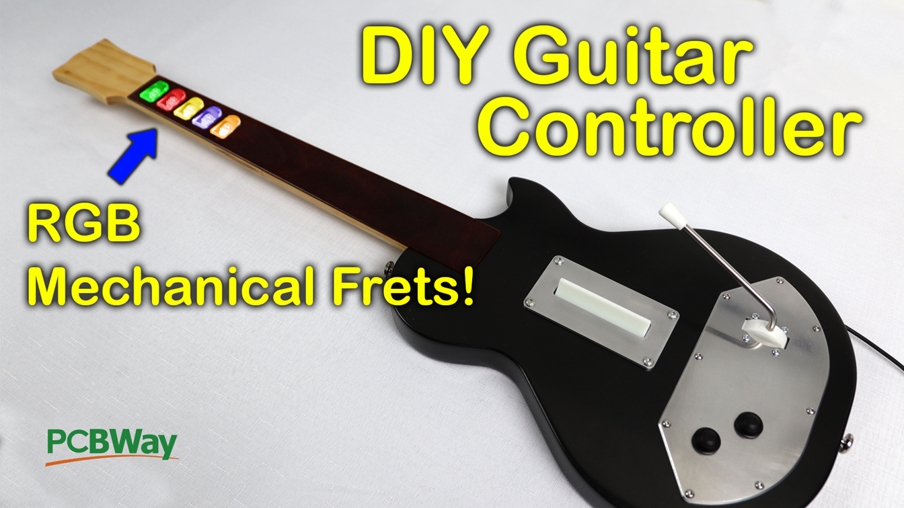
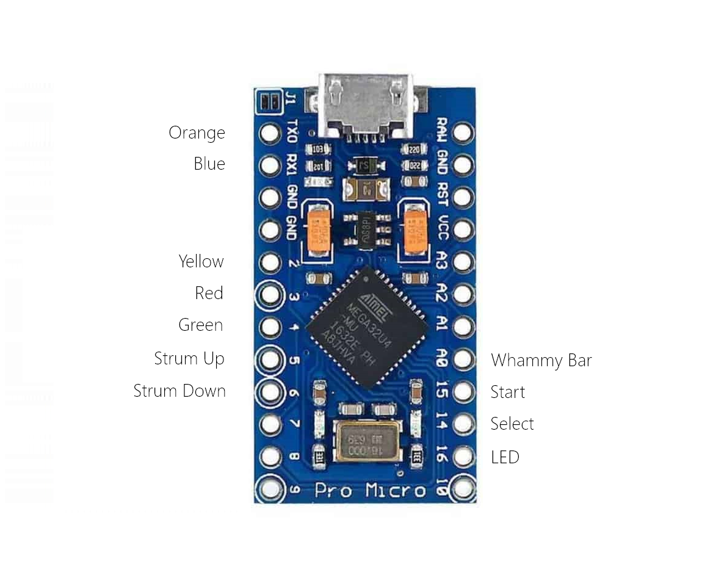

# DIYCloneHeroController

Here's the printed version of my clone hero controller! 

#### Assembly
The original Youtube video should provide enough information for assembly, here's a link:

[The ULTIMATE DIY Clone Hero Controller](https://youtu.be/poKoy9RzIDI)

I've included 3mm holes between all of the printed body and kneck parts to help with alignment and strength when glueing them together for assembly.

#### Software
The Arduino code is pretty bare-bones, but its enough to get the controller functioning properly, it just doesn't have any fancy effects for the RGB lights, its just set up for a solid colour per button. There are other more feature rich softwares out there for diy guitar controllers so feel free to use one of those instead if you'd prefer. You may have to refer to their wiring diagram's for everything to work correctly though!

#### Wiring
Wiring for buttons is shown below on a Pro Micro Clone. You should be able to use the same pinout on any 32u4 based arduino. VCC and GND need to also be connected both to the Strum bar pcb and the
whammy bar potentiometer. The Strum bar PCB passes VCC and GND through to the neck PCB.
I used a 10k potentiometer for my whammy bar. The order that the buttons are connected in doesn't actually matter, as you'll configure them in clone hero anyway but if you stick to the pins I've specified you won't have to change the code. The LED signal is connected to pin 16.

#### PCB's
The neck and strum PCB's are designed to use a full sized mechanical keyboard switch. Any should work, but I used Gateron Blue's on mine since they were cheap and readily available to me.

If you're planning to use the RGB LED's you will also need:
- 10x 33ohm 0603 Resistors
- 5x WS2811 IC's
- 5x 0.1uf 0603 Capacitors
- 5x 100ohm 0603 Resistors
- 5x RGB LED's [Link](https://www.aliexpress.com/item/1005003719602946.html)

Please note on the neck PCB silk screen, one resistor on the orange fret is incorrectly labelled as a 0.1uf capacitor when it should be a 33ohm resistor. The components are in the same order on all 5 frets so just refer to the other fret buttons for the correct order. 